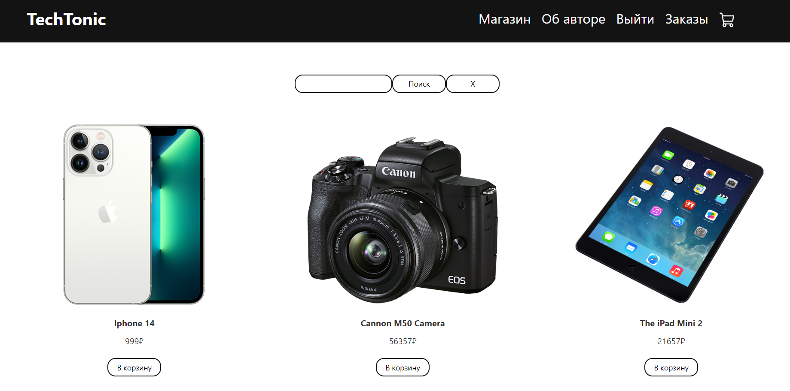
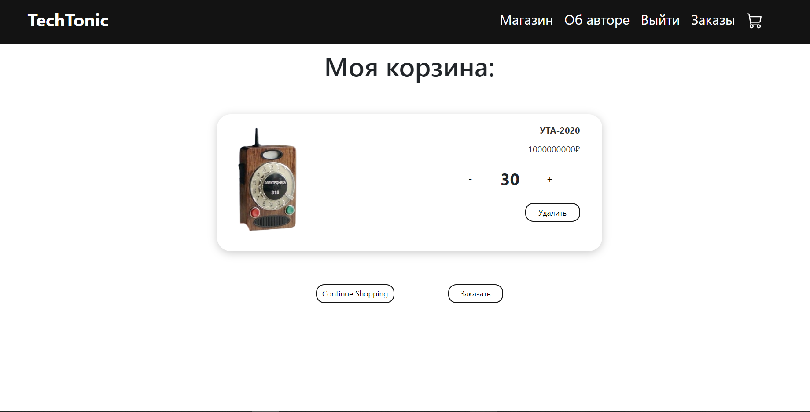
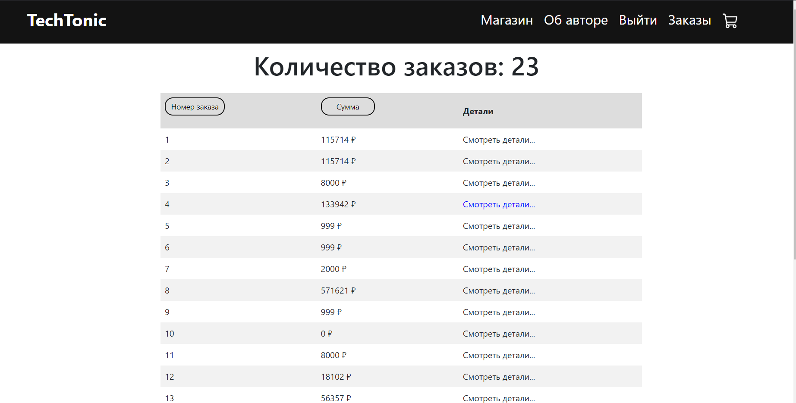
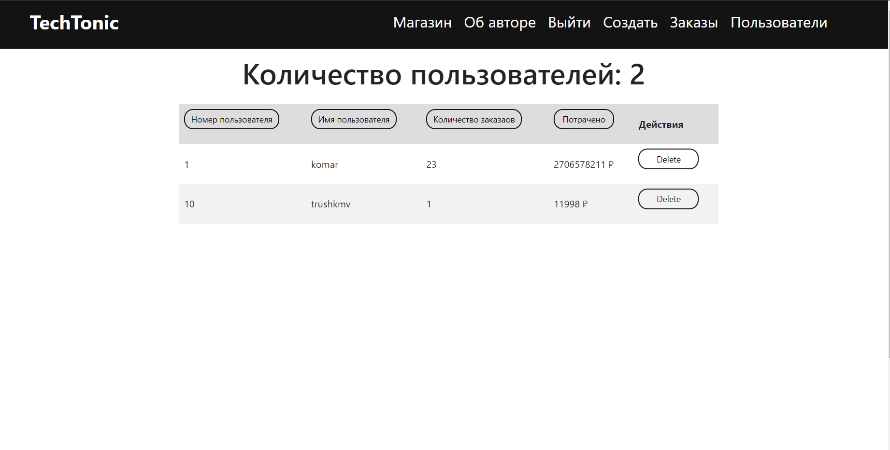

# TechTonic (Frontend)

Этот проект был запущен с помощью [Create React App](https://github.com/facebook/create-react-app).

## Использованные технологии
+ React TypeScript
+ CSS шаблоны: https://github.com/petermartens98/React-Ecommerce-Site
+ Bootstrap
## Getting start
1) Открой 3000 порт на localhost [http://localhost:3000](http://localhost:3000)
если порт занят, то https://stackoverflow.com/questions/39632667/how-do-i-kill-the-process-currently-using-a-port-on-localhost-in-windows
2) Запусти бэкэнд: https://github.com/pyyogi/tech-tonic 
3) `npm start` - напиши в терминале, чтобы запустить приложение

## Главная страница для пользователя

## Главная страница для администратора

## Корзина пользователя

## Заказы пользователя

## Страница со всеми пользователями (доступна только администратору)
